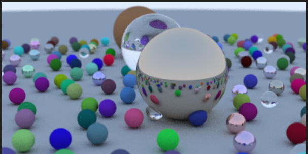

# RayTracing-Photorealistic-Rendering


## Description

Welcoming to the Ray Tracing project. This project is a C++-based Ray Tracer designed to render realistic 3D scenes by simulating the behavior of light. It supports multiple objects, different shapes, and various material types, allowing for a highly customizable rendering environment. The ray tracer incorporates fundamental rendering techniques such as reflection, refraction, and shading, enabling the generation of visually accurate images. Supports rendering of spheres, planes, and other geometric objects. Implements different surface properties, including diffuse, reflective, and refractive materials.Ability to handle complex scenes with numerous objects.The programming language used is c++.Ray tracing algorithm to compute pixel colors based on light interaction.Uses vector mathematics and physics-based lighting models for realism.Adding texture mapping and environment mapping.Optimizing with multi-threading for faster rendering.This project serves as a foundation for learning and exploring advanced rendering techniques in computer graphics. Contributions and optimizations are welcome!




## Getting Started

### Dependencies

* Before developing or running this ray tracing project, ensure that you have the necessary *theoretical knowledge, programming skills, and software setup*.  

### 1. Theoretical Knowledge  
To understand and develop the core components of this ray tracer, you should be familiar with:  
- *Vector Operations*: Dot product, cross product, and vector transformations.  
- *Ray Optics: Concepts of **reflection, refraction*, Snell’s Law, and light interactions.  
- *Mathematical Foundations*: Linear algebra and geometry for ray tracing calculations.  

### 2. Programming Knowledge  
- *C++ Basics*: Strong understanding of syntax, memory management, and STL.  
- *Object-Oriented Programming (OOPs)*: Knowledge of classes, inheritance, polymorphism, and encapsulation.  

### 3. Software Requirements  
Ensure that the following software is installed for development:  
- *VS Code* (Recommended IDE) – [Download Here](https://code.visualstudio.com/)  
- *C++ Compiler*:  
  - Windows: MinGW / MSVC (Microsoft Visual C++)  
  - Linux: GCC / Clang
- *PPM Extension* - Required for creating the PPM image after rendoring the program.

  -


### Executing program

Follow these steps to compile and run the program:  

### 1. Compiling the Code  
- Click on the *Run* button (usually located at the top right corner in VS Code) to compile the code automatically.  
- Alternatively, you can compile manually using a terminal or command prompt.  
- This is the final look in the terminal when code gets compiled successfully , here is the image 


### 2. Running the Executable  
1. Navigate to the folder where your compiled code is stored.  
2. Open the *Command Prompt* or *Terminal* in that directory:  
   - On Windows:  
     - Go to the folder in *File Explorer*, then type cmd in the address bar and press *Enter*.  
   - On Linux:  
     - Open a terminal and use cd /path/to/your/project/folder.  

3. Run the program using the following syntax: 
    ```
    cd path/to/your/project  
    ```
    ```
   ./main.cpp > image_name.ppm
    ```


## Help

- *Ensure All Required Libraries Are Included*  
  - Before compiling, double-check that all necessary libraries and header files are included in your main code to avoid missing dependencies.  

- *Keep All Files in the Same Folder*  
  - To ensure smooth execution, store all project files (source code, headers, assets) in the same directory.  
  - This helps avoid path-related errors when running the main program.  

If you encounter any issues, verify these points before troubleshooting further. 🚀


## Authors

This project was developed by:  

- *Jay Katre*  
- *Rohit Bahuguna*  
- *Kanha Tayal*  
- *Saksham Tiwari*  
- *Smarak Patnaik*  

### Book Reference  
The concepts and techniques used in this project are inspired by the book:  
- *Ray Tracing in One Weekend* by *Peter Shirley*  

We appreciate all contributions to improve and optimize this project. If you'd like to contribute, feel free to submit a pull request or report issues. 🚀


## Acknowledgments

We would like to express our sincere gratitude to the following individuals and resources:  

- *Peter Shirley, author of the book *Ray Tracing in One Weekend, whose work greatly influenced the techniques and algorithms implemented in this project.  
- Our *mentors* and *peers* for their valuable insights and feedback throughout the development process.  
- The open-source community for providing tools, libraries, and frameworks that made this project possible, including *CMake, **GLFW, and **Eigen*.  
- Special thanks to the *contributors* for their support in optimizing and enhancing the project.  

Without these resources and individuals, this project would not have been possible. 